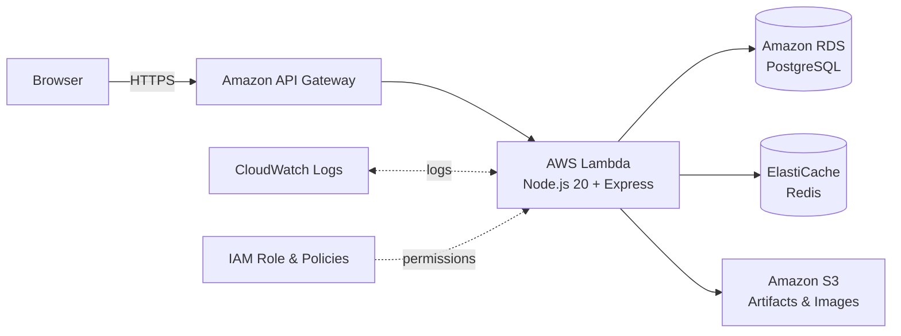
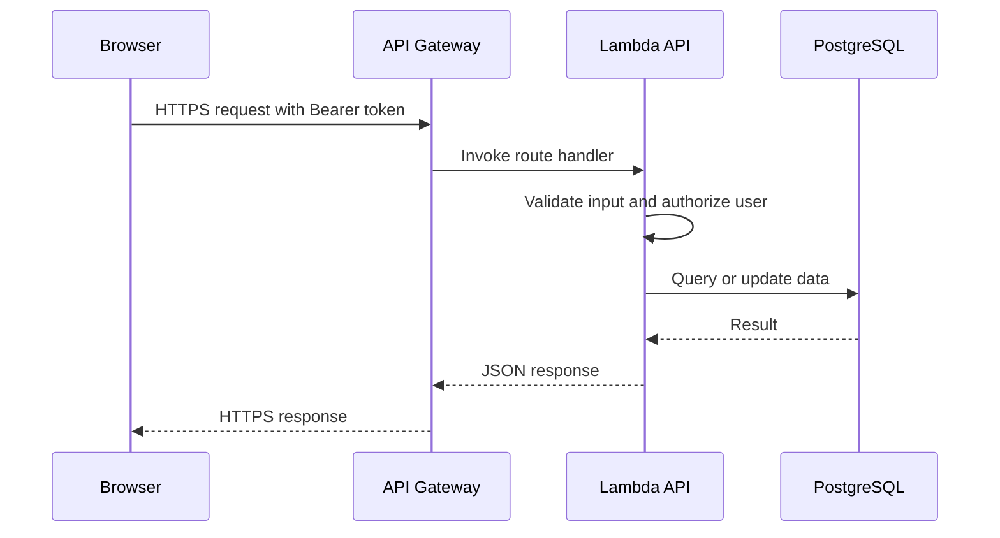

{}
⚠️ **Note:** The information below is for reference purposes only. Please **do not copy verbatim** for your report, including this warning.
{}

### Overall Architecture

The VTrips architecture follows a serverless-first approach with clear separation between frontend, API, compute, data storage, messaging, and monitoring layers. Users access the application through the frontend, while business requests go through API Gateway and are handled by the Lambda API Handler.

### Deployed MVP Architecture

### AWS Service Responsibilities

| AWS service | Responsibility |
| --- | --- |
| API Gateway | Public HTTPS entry point and request routing to Lambda |
| Lambda | TypeScript/Node.js API runtime and business logic |
| RDS PostgreSQL | Transactional data for users, places, trips, reviews, and bookings |
| ElastiCache Redis | Hot data cache and short-lived application state |
| S3 | Lambda deployment artifacts and uploaded images |
| CloudWatch | Logs and diagnostics |
| IAM | Least-privilege access control for Lambda |

### Main Request Flow

For an authenticated API request, the browser sends an HTTPS request with a Bearer token to API Gateway. API Gateway invokes Lambda, Lambda validates input, authorizes the user, queries or updates PostgreSQL/Redis/S3, and returns a JSON response to the frontend.

### Image Upload Flow

1. An authenticated user requests an upload URL from the API.
2. Lambda validates ownership and generates a short-lived S3 presigned URL.
3. The browser uploads the file directly to S3.
4. The frontend stores or displays the resulting image URL in the related place/review.

This keeps AWS credentials out of the browser and avoids sending large files through Lambda.

### Security, Logging, and Cost Optimization

* RDS and Redis should stay in private subnets and should not be exposed directly to the Internet.
* Database/cache Security Groups should allow inbound traffic only from the Lambda Security Group.
* Secrets such as database URLs and JWT secrets must not be committed to source code.
* Lambda execution roles should only have the required S3, log group, and resource permissions.
* API Gateway should configure CORS, throttling, and production frontend origin restrictions.
* CloudWatch Logs help debug Lambda errors, latency, timeouts, and database/cache connectivity issues.
* S3 lifecycle policies and log retention should be configured to control costs.

