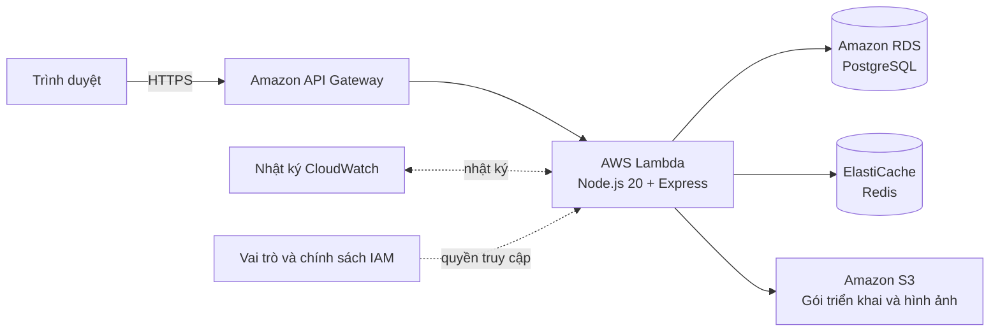
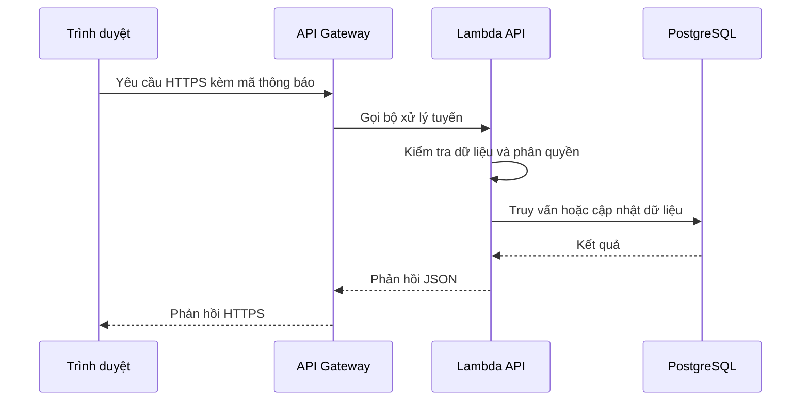

### Kiến trúc tổng thể

Kiến trúc VTrips ưu tiên mô hình phi máy chủ, với sự phân tách rõ ràng giữa giao diện, API, xử lý, lưu trữ dữ liệu, truyền thông điệp và giám sát. Người dùng truy cập ứng dụng qua giao diện web; các yêu cầu nghiệp vụ đi qua API Gateway và được Lambda xử lý.

### Kiến trúc MVP đã triển khai

### Trách nhiệm của các dịch vụ AWS

| Dịch vụ AWS | Trách nhiệm |
| --- | --- |
| API Gateway | Điểm vào HTTPS công khai và định tuyến yêu cầu đến Lambda |
| Lambda | Chạy API TypeScript/Node.js và xử lý logic nghiệp vụ |
| RDS for PostgreSQL | Lưu dữ liệu giao dịch về người dùng, địa điểm, chuyến đi, đánh giá và đặt chỗ |
| ElastiCache for Redis | Lưu dữ liệu thường dùng và trạng thái ngắn hạn trong bộ nhớ đệm |
| S3 | Lưu gói triển khai Lambda và ảnh được tải lên |
| CloudWatch | Thu thập nhật ký và hỗ trợ chẩn đoán |
| IAM | Kiểm soát truy cập theo nguyên tắc đặc quyền tối thiểu cho Lambda |

### Luồng yêu cầu chính

Đối với một yêu cầu API đã xác thực, trình duyệt gửi yêu cầu HTTPS kèm mã thông báo truy cập đến API Gateway. API Gateway gọi Lambda; Lambda kiểm tra dữ liệu đầu vào, phân quyền người dùng, truy vấn hoặc cập nhật PostgreSQL, Redis, S3 rồi trả kết quả JSON về giao diện.

### Luồng tải ảnh

1. Người dùng đã xác thực yêu cầu một URL tải lên từ API.
2. Lambda kiểm tra quyền sở hữu và tạo URL ký sẵn của S3 có thời hạn ngắn.
3. Trình duyệt tải tệp trực tiếp lên S3.
4. Giao diện lưu hoặc hiển thị URL ảnh trong địa điểm hay đánh giá liên quan.

Cách này giữ thông tin xác thực AWS bên ngoài trình duyệt và tránh gửi tệp lớn qua Lambda.

### Bảo mật, ghi nhật ký và tối ưu chi phí

* RDS và Redis nên nằm trong mạng con riêng tư, không công khai trực tiếp trên Internet.
* Nhóm bảo mật của cơ sở dữ liệu và bộ nhớ đệm chỉ cho phép lưu lượng vào từ nhóm bảo mật của Lambda.
* URL cơ sở dữ liệu, khóa JWT và thông tin bí mật không được đưa vào kho mã.
* Vai trò thực thi Lambda chỉ có quyền với đúng vùng lưu trữ S3, nhóm nhật ký và tài nguyên cần thiết.
* API Gateway cần cấu hình CORS, giới hạn lưu lượng và miền giao diện được phép truy cập.
* Nhật ký CloudWatch hỗ trợ chẩn đoán lỗi Lambda, độ trễ, hết thời gian và lỗi kết nối dữ liệu.
* Chính sách vòng đời S3 và thời gian lưu nhật ký cần được cấu hình để kiểm soát chi phí.

