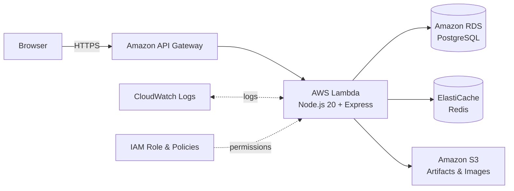
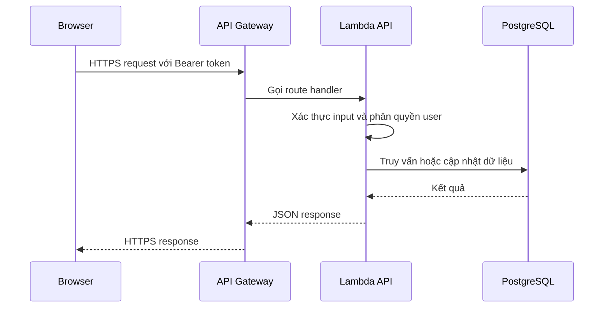

{}
⚠️ **Lưu ý:** Các thông tin dưới đây chỉ nhằm mục đích tham khảo, vui lòng **không sao chép nguyên văn** cho bài báo cáo của bạn kể cả warning này.
{}

### Kiến trúc Tổng thể

Kiến trúc VTrips tuân theo hướng serverless-first với sự phân tách rõ ràng giữa các tầng frontend, API, compute, data storage, messaging và monitoring. Người dùng truy cập ứng dụng qua frontend, trong khi các request nghiệp vụ đi qua API Gateway và được xử lý bởi Lambda API Handler.

### Kiến trúc MVP đã Triển khai

### Trách nhiệm Dịch vụ AWS

| Dịch vụ AWS | Trách nhiệm |
| --- | --- |
| API Gateway | Điểm vào HTTPS công khai và định tuyến request đến Lambda |
| Lambda | Runtime API TypeScript/Node.js và business logic |
| RDS PostgreSQL | Dữ liệu giao dịch cho users, places, trips, reviews và bookings |
| ElastiCache Redis | Cache dữ liệu nóng và trạng thái ứng dụng ngắn hạn |
| S3 | Artifacts triển khai Lambda và ảnh tải lên |
| CloudWatch | Logs và chẩn đoán |
| IAM | Kiểm soát truy cập least-privilege cho Lambda |

### Luồng Request Chính

Đối với một API request đã xác thực, browser gửi HTTPS request với Bearer token đến API Gateway. API Gateway gọi Lambda, Lambda xác thực input, phân quyền user, truy vấn hoặc cập nhật PostgreSQL/Redis/S3 và trả về JSON response cho frontend.

### Luồng Tải Ảnh

1. Người dùng đã xác thực yêu cầu URL tải lên từ API.
2. Lambda xác thực quyền sở hữu và tạo S3 presigned URL ngắn hạn.
3. Browser tải file trực tiếp lên S3.
4. Frontend lưu trữ hoặc hiển thị URL ảnh kết quả trong place/review liên quan.

Cách này giữ AWS credentials ngoài browser và tránh gửi file lớn qua Lambda.

### Bảo mật, Logging và Tối ưu Chi phí

* RDS và Redis nên nằm trong private subnets và không được expose trực tiếp ra Internet.
* Database/cache Security Groups chỉ nên cho phép inbound traffic từ Lambda Security Group.
* Secrets như database URLs và JWT secrets không được commit vào source code.
* Lambda execution roles chỉ nên có các quyền S3, log group và resource cần thiết.
* API Gateway nên cấu hình CORS, throttling và giới hạn origin frontend production.
* CloudWatch Logs giúp debug lỗi Lambda, latency, timeouts và vấn đề kết nối database/cache.
* S3 lifecycle policies và log retention nên được cấu hình để kiểm soát chi phí.

